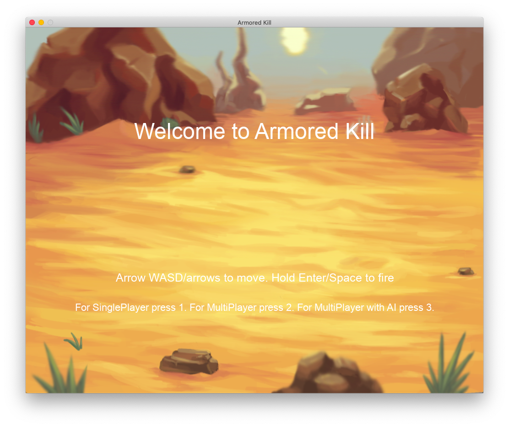

# ℹ️ Tank Game
The tank game using Python 3 and Library Pygame.




## ❗️ Requirements
- :arrow_up:

	Library Pygame:

	```
	Bash shell
	$ pip install pygame
	```
	Python3:

	```
	Bash shell
	$ python3 -V
	Python 3.7.7
	```
 
 ### :headphones: Sound :
* Music and sound for:
	* Explosions
	* Shots
	* Power Up
	* OST

## 🤘 Controls

|              | Button              |
|--------------|---------------------|
| Move Up   | <kbd>W</kbd>    |
| Move Down   | <kbd>S</kbd>    |
| Move Left    | <kbd>A</kbd>     |
| Move Right   | <kbd>D</kbd>   	|
| Move Up   | <kbd>↑</kbd>    |
| Move Down   | <kbd>↓</kbd>    |
| Move Left    | <kbd>←</kbd>     |
| Move Right   | <kbd>→</kbd>   	|
| Fire  | <kbd>Space</kbd> |
| Fire  | <kbd>Enter</kbd> |
| Quit game    | <kbd>Esc</kbd>      |